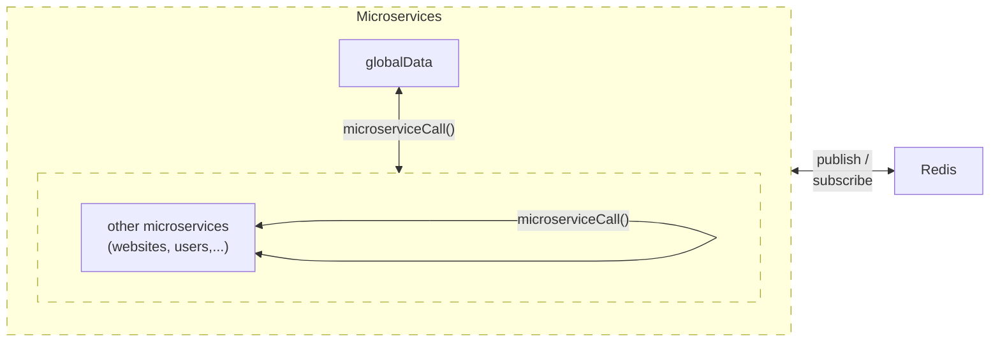

# Digitalni web - Microservices

## How it works

-   Microservices 'globalData' needs to be started first, then other services
-   Redis must be installed. "globalData" microservice works as "service registry" and it registers all services and applications via Redis messaging system automatically on service start.
-   "globalData" also works as "Single source of truth".
-   Multiple "globalData" microservices can only be synchronized copy for load ballancing.
-   Other microservices might be sharded to multiple servers by setting "mainId" of currently used service to write to.

Then all microservices and applications can communicate with each other via "microserviceCall" and "appCall" methods in "/digitalniweb-custom/helpers/remoteProcedureCall.ts" respectively. These are intentioned to be ran on server side only.

Every microservice and application needs submodules https://github.com/digitalniweb/digitalniweb-types and https://github.com/digitalniweb/digitalniweb-custom

## Microservices

### GlobalData

You need to run seeders to work properly because we need initial languages, currencies, modules, widgets etc.

### Websites

#### modules

Are self contained components or functionalities like 'articles', 'products', 'blog posts', 'news', etc.

Modules might be premium i.e. paid for.

Different Applications might have different modules.

**Modules might be:**

1. Modules like 'Articles' and 'Products' have their own menus

2. Modules like 'BlogPosts' and 'News' on the other hand have list pagination of all posts

3. There might be other modules with simple or complex functionalities - Eshop (multiple tables and functionalities)

If modules have their own dedicated root url ('/news' in '/news/we-started-new-website') their default values are specified in ["ModulePageLanguage"](digitalniweb-types/models/globalData.ts#ModulePageLanguage) for every Language. These values might be shown on the root page or other pages as well (depends on the individual module). (To implement maybe - user will be able to change these default values in 'content ms' for every website)

#### widgets

Are smaller components inside modules like text, banner, etc.

## Authorization and authentication

There are 2 types of 'Authorization':

### admins

'superadmins' can change everything on any site and any microservice. Might even have dedicated options which others don't see

'owners' are admins with all privileges for particular site e.g. Tenants are owners of their sites

'admins' can access 'admin backend' and have assigned privileges (model 'Action') like 'write', 'read' etc. for certain 'modules'. These privileges can be changed by 'owner' or 'admin' with privileges to change privileges to 'admins'.

### users

'user' is registered user

'tenant' is user who ordered a website in 'SaaS' - 'tenant' on 'saas-host' is 'owner' on 'saas-tenants'

## Applications

-   see https://github.com/digitalniweb/saas

# Other information

## Installation

Use `git clone  --recurse-submodules https://github.com/digitalniweb/microservices.git .` to create a new repository in current folder with submodules

    !!! Submodules' git branches need to be changed to "master"

## Sequelize CLI

Before running `sequelize-cli` package commannds we need to compile code via:

    npm run buildSequelize

Because `.sequelizerc` uses commonJS and Node's `type` in `package.json` is set to `module` we need to compile migrations and seeders to commonJS and add `tsconfig.json` file to the transpiled folder.

Then we can use `scripts` from `package.json` (which can be updated if needed)

### Migrations

-   [documentation](https://https://sequelize.org/docs/v6/other-topics/migrations/)

Migrations have dedicated table in database unlike seeders

#### Up

    npm run migrations

#### Down

revert all:

    npm run migrationsUndoAll

specific:

    npx sequelize-cli db:migrate:undo --name 'name-of-migration-file.js'

### Seeders

-   [documentation](https://sequelize.org/docs/v6/other-topics/migrations/)

#### Up

All seeders

    npm run seeders

Specific seeder

    npx sequelize-cli db:seed --seed 'name-of-seed-file.js'

#### Down

Before running these commands, we need to run `npm run buildSequelize` first

revert the most recent seeder (only last file via date name):

    npx sequelize-cli db:seed:undo

revert specific seed:

    npx sequelize-cli db:seed:undo --seed 'name-of-seed-file.js'

revert all:

    npx sequelize-cli db:seed:undo:all

## Communication of microservices

**globalData** is single source of truth!

